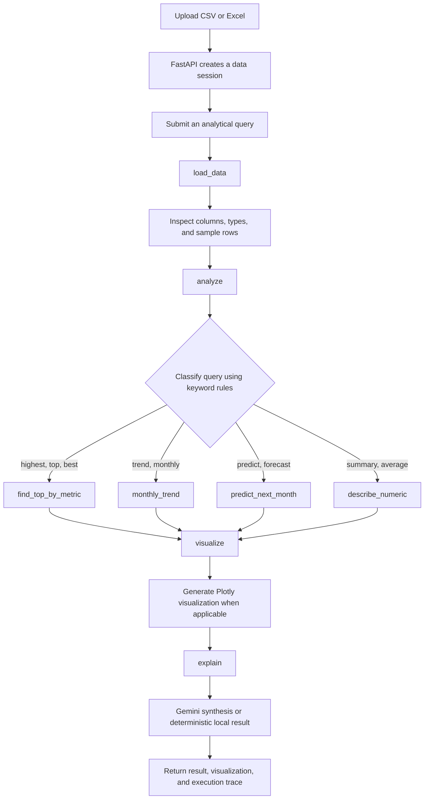

# AI Data Analyst Agent

A data-analysis application for structured business datasets. The system ingests CSV and Excel files, classifies analytical queries through deterministic keyword rules, executes predefined Pandas and NumPy operations, generates Plotly visualizations, and presents computed results. Google Gemini provides optional explanatory synthesis.

## Problem

Business analysis frequently depends on manual spreadsheet operations, predefined dashboards, or direct support from data specialists. Conventional dashboards are limited to metrics and views anticipated during development, while ad hoc investigation requires technical proficiency and additional operational effort.

## Solution

This project implements a structured data-analysis workflow:

1. A user uploads a CSV or Excel file.
2. The application inspects its columns and data types.
3. The user submits an analytical query through the interface.
4. Deterministic keyword rules classify the query as ranking, trend, forecast, or summary analysis.
5. The corresponding predefined Pandas or NumPy function calculates the result.
6. Plotly creates a visualization when applicable.
7. Google Gemini optionally produces a concise explanatory synthesis.
8. Streamlit displays the result, visualization, and workflow steps.

Language-model integration is separated from numerical computation. Pandas and NumPy produce the analytical results, while Gemini receives structured outputs for explanatory synthesis. Quota exhaustion or service unavailability triggers a deterministic local fallback.

## Included Sample Datasets

- `data/sample_sales.csv` - product and regional sales
- `data/sample_marketing.csv` - campaign spend, revenue, and conversions
- `data/sample_customer_orders.csv` - customer and regional orders
- `data/sample_inventory.csv` - products, categories, units, and revenue

Each dataset can be selected for immediate analysis or downloaded from the application sidebar.

## System Architecture

```text
┌──────────────────────┐
│   Streamlit Web UI   │
│   localhost:8510     │
└──────────┬───────────┘
           │ file upload / query
           ▼
┌──────────────────────┐
│   FastAPI Backend    │
│   localhost:8010     │
└──────────┬───────────┘
           │ invokes
           ▼
┌──────────────────────┐
│ LangGraph Workflow   │
│ load → analyze →     │
│ visualize → explain  │
└──────────┬───────────┘
           │
     ┌─────┴──────────────┐
     ▼                    ▼
┌─────────────────┐  ┌─────────────────┐
│ Pandas / NumPy  │  │   Gemini API    │
│ deterministic   │  │ explanatory     │
│ computation     │  │ synthesis       │
└────────┬────────┘  └────────┬────────┘
         │                    │
         └──────────┬─────────┘
                    ▼
          ┌─────────────────┐
          │ Result + Chart  │
          └─────────────────┘
```

## Analytical Workflow



### Workflow nodes

- `load_data` reads the uploaded file and summarizes its schema.
- `analyze` applies deterministic keyword rules and executes the corresponding predefined analysis function.
- `visualize` creates a bar or line chart when supported by the analytical output.
- `explain` produces an explanatory synthesis from the structured result.

### Analysis functions

- `find_top_by_metric` groups a business dimension and ranks a numeric metric.
- `monthly_trend` converts dates into months and aggregates values over time.
- `predict_next_month` fits a least-squares linear trend to monthly totals.
- `describe_numeric` returns descriptive statistics for numeric columns.

## Technology Stack

- **Python** - application language
- **LangGraph** - stateful agent orchestration
- **Pandas** - file loading, grouping, aggregation, and statistics
- **NumPy** - linear-trend forecasting
- **Plotly** - interactive charts
- **FastAPI** - dataset ingestion and analytical-query REST API
- **Streamlit** - interactive analytical interface
- **Google Gemini** - optional explanatory synthesis
- **Pytest** - unit and API tests
- **Docker Compose** - local container orchestration
- **GitHub Actions** - automated test and Docker-build checks
- **Render** - deployment configuration

## Project Structure

```text
ai-data-analyst-agent/
├── app/
│   ├── agent/
│   │   ├── graph.py             # LangGraph nodes and workflow
│   │   └── state.py             # Shared agent-state definition
│   ├── api/
│   │   └── main.py              # FastAPI routes and upload sessions
│   ├── tools/
│   │   ├── analytics.py         # Analysis and forecasting tools
│   │   ├── data_loader.py       # CSV/Excel loading and schema summary
│   │   └── visualization.py     # Plotly chart generation
│   └── config.py                # Environment-based application settings
├── frontend/
│   └── streamlit_app.py         # Web interface and query session
├── data/
│   ├── sample_sales.csv         # Product sales demonstration
│   ├── sample_marketing.csv     # Marketing campaign demonstration
│   ├── sample_customer_orders.csv # Customer order demonstration
│   ├── sample_inventory.csv     # Inventory demonstration
│   └── uploads/                 # Temporary uploaded files
├── docs/
│   └── agent_workflow.md        # Standalone workflow reference
├── tests/
│   ├── test_analytics.py        # Data-tool unit tests
│   └── test_agent_api.py        # Upload and API integration tests
├── scripts/
│   └── start.sh                 # Container startup script
├── .github/workflows/
│   └── ci.yml                   # GitHub Actions workflow
├── .env.example                 # Environment-variable template
├── Dockerfile                   # Application container image
├── docker-compose.yml           # API and UI services
├── Makefile                     # Common development commands
├── render.yaml                  # Render deployment blueprint
├── requirements.txt             # Python dependencies
└── README.md
```

## Local Setup

### Requirements

- Python 3.11 or newer
- Git
- Optional Google Gemini API credentials

### Installation

```bash
git clone https://github.com/YOUR_USERNAME/ai-data-analyst-agent.git
cd ai-data-analyst-agent
python3 -m venv .venv
source .venv/bin/activate
pip install --upgrade pip
pip install -r requirements.txt
cp .env.example .env
```

API credentials may be generated through [Google AI Studio](https://aistudio.google.com/apikey). Configure `.env` as follows:

```env
GEMINI_API_KEY=your-gemini-key
GEMINI_MODEL=gemini-2.0-flash
UPLOAD_DIR=data/uploads
API_HOST=0.0.0.0
API_PORT=8010
```

The application operates without a Gemini key because analysis, forecasting, and visualization are executed locally. When Gemini is configured, HTTP `429` quota responses trigger an automatic fallback to the deterministic local output.

## Running the Application

Start the API:

```bash
source .venv/bin/activate
uvicorn app.api.main:app --reload --host 0.0.0.0 --port 8010
```

Start the UI in a second terminal:

```bash
source .venv/bin/activate
API_URL=http://localhost:8010 streamlit run frontend/streamlit_app.py --server.port 8510
```

Open:

- Streamlit UI: [http://localhost:8510](http://localhost:8510)
- API health check: [http://localhost:8010/health](http://localhost:8010/health)
- Interactive API docs: [http://localhost:8010/docs](http://localhost:8010/docs)

## REST API

### Health check

```http
GET /health
```

Returns the backend's availability.

### Upload a dataset

```http
POST /upload
Content-Type: multipart/form-data
```

Accepts `.csv`, `.xlsx`, or `.xls` and returns a session ID plus dataset summary.

### Submit an analytical query

```http
POST /ask
Content-Type: application/json
```

Example body:

```json
{
  "session_id": "session-id-returned-by-upload",
  "question": "analytical-query-text"
}
```

Returns the answer, analysis output, optional chart, agent mode, and execution steps.

### Inspect a session

```http
GET /sessions/{session_id}
```

Returns the uploaded filename and dataset summary.

## Testing

```bash
source .venv/bin/activate
pytest
```

The tests cover:

- CSV loading
- Highest-revenue analysis
- Monthly aggregation
- Next-month prediction
- Query-classification logic
- API health
- File upload
- End-to-end query processing
- Invalid-session handling

## Docker

```bash
cp .env.example .env
docker compose up --build
```

The API is exposed on port `8010` and Streamlit on port `8510`.

Stop the containers with:

```bash
docker compose down
```

## Continuous Integration

The workflow in `.github/workflows/ci.yml` runs on pull requests and pushes to any branch. It:

1. Checks out the repository.
2. Installs Python 3.11.
3. Installs dependencies.
4. Runs the Pytest suite.
5. Builds the Docker image.

## Deployment

`render.yaml` defines separate Render services for the FastAPI backend and Streamlit frontend.

Required hosted environment variables:

```env
GEMINI_API_KEY=your-gemini-key
GEMINI_MODEL=gemini-2.0-flash
API_URL=https://your-api-service.onrender.com
```

The `.env` file is excluded by `.gitignore` and must not be committed to version control.
