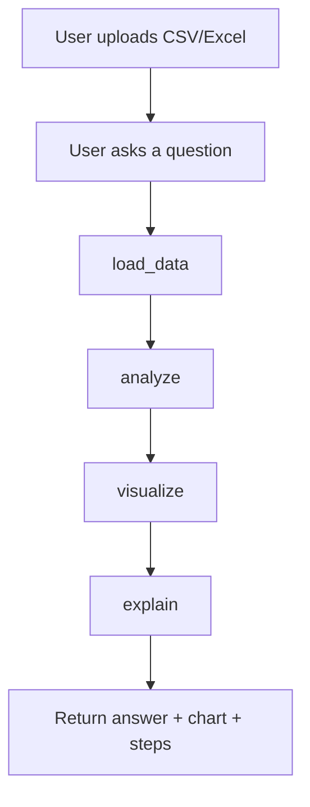

# Agent Workflow Diagram

This app uses a simple LangGraph workflow.

```text
User question + uploaded file
            |
            v
     +-------------+
     |  load_data  |  <- read CSV/Excel, summarize columns
     +-------------+
            |
            v
     +-------------+
     |   analyze   |  <- pick tool (top product / trend / forecast / summary)
     +-------------+
            |
            v
     +-------------+
     |  visualize  |  <- build Plotly chart when useful
     +-------------+
            |
            v
     +-------------+
     |   explain   |  <- Gemini free tier (or local tool answer)
     +-------------+
            |
            v
     Final answer + chart + steps
```

## Tools the agent can use

| Tool | When it runs | What it does |
|------|--------------|--------------|
| `find_top_by_metric` | highest / top / best | Groups by product/region and ranks revenue |
| `monthly_trend` | trend / monthly | Aggregates metric by month |
| `predict_next_month` | predict / forecast | Linear trend forecast for next month |
| `describe_numeric` | summary / average | Pandas descriptive statistics |

## Mermaid version


